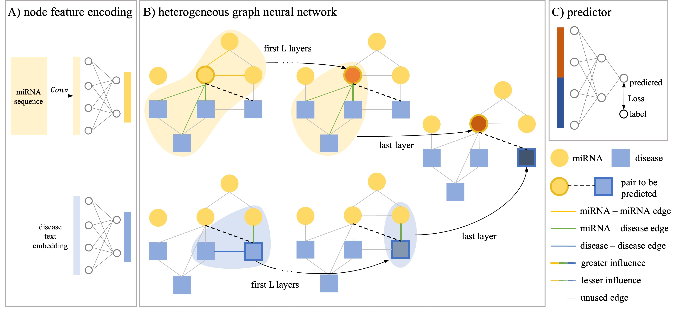

# MMMDA
Multi-level attention and multi-depth message passing graph neural network for miRNA-disease association prediction
 


## Train
```bash
python train.py --dataset ["data_hmdd3.2" or "data_hmdd4" or "data_rnadisease"]
```

## Test
```bash
python test.py --dataset ["data_hmdd3.2" or "data_hmdd4" or "data_rnadisease"]
```

## Dataset
The data can be downloaded from：[Google Drive](https://drive.google.com/file/d/16yuQaAIEqQ6wLDqeYlRip84zmwDadySJ/view?usp=sharing)

If you have questions, welcome to contact me at wumeixuan@stu.scu.edu.cn!